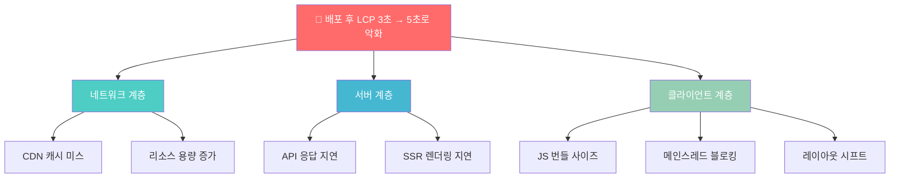
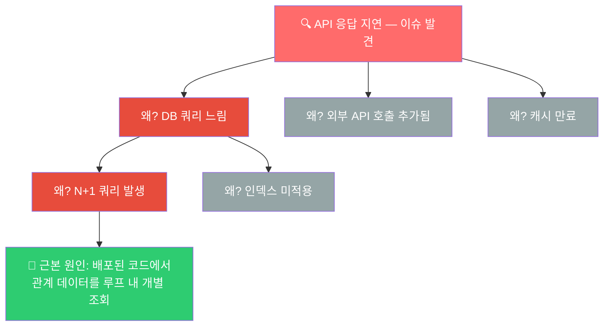
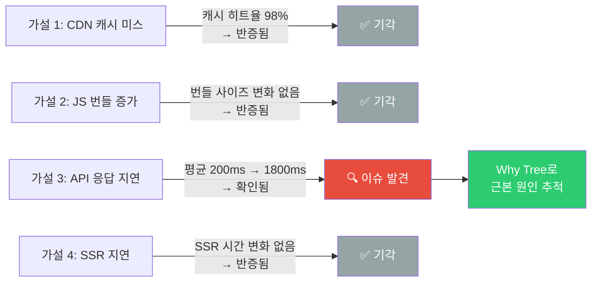
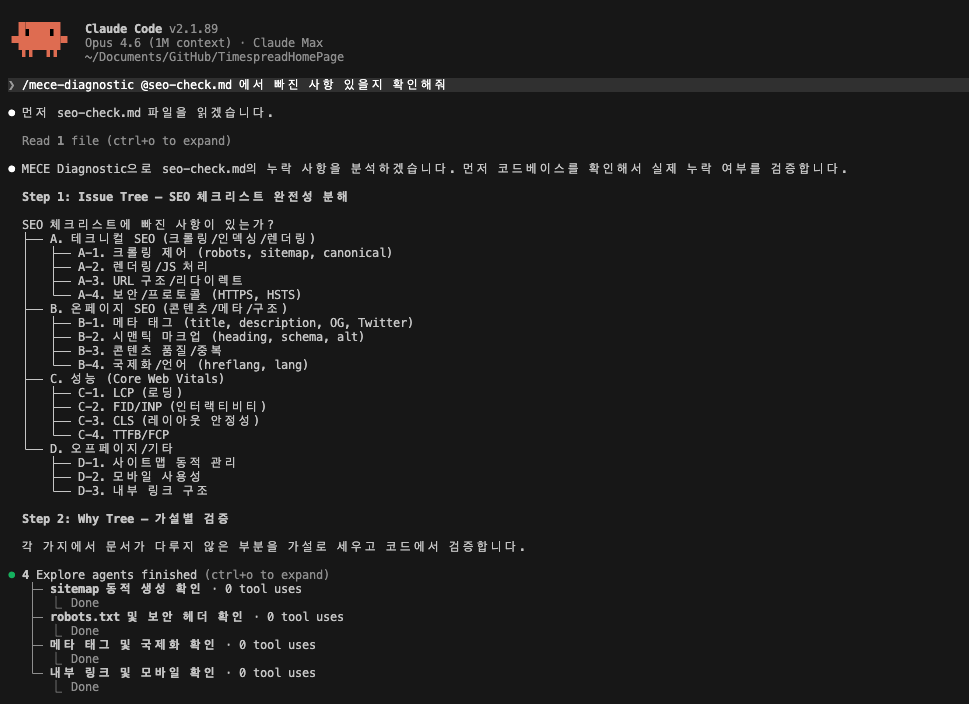
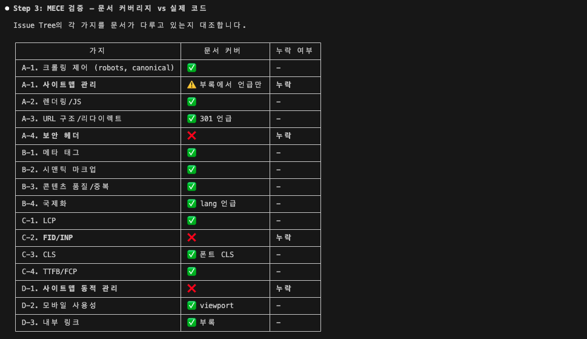
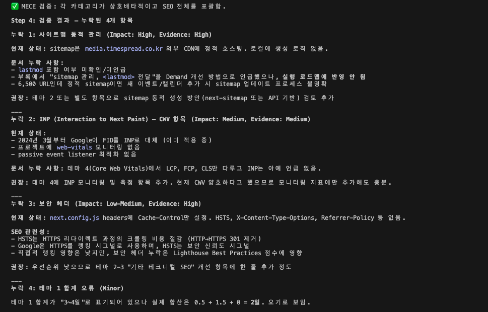
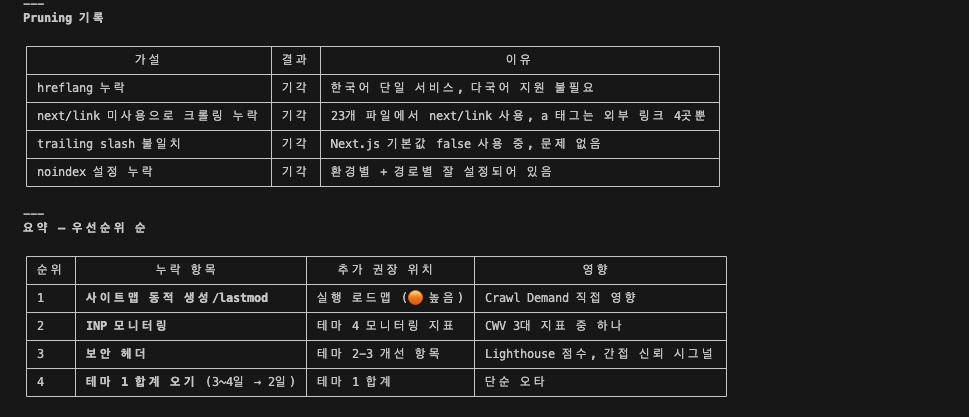

# MECE Diagnostic (미씨 다이아그노스틱)

**AI 코드 어시스턴트를 위한 구조화된 문제 분석 프레임워크**

McKinsey의 MECE(Mutually Exclusive, Collectively Exhaustive) 원칙과 Diagnostic Pruning 기법을 AI 코딩 어시스턴트(Claude Code)에 적용한 스킬입니다.

---

## 목차

- [왜 만들었는가](#왜-만들었는가)
- [한눈에 보는 비교](#한눈에-보는-비교)
- [MECE란?](#mece란)
- [프레임워크 흐름](#프레임워크-흐름)
  - [Issue Tree — 문제를 MECE하게 분해](#issue-tree--문제를-mece하게-분해)
  - [Why Tree — 원인을 깊이 파고들기](#why-tree--원인을-깊이-파고들기)
  - [Pruning — 검증하고 가지치기](#pruning--검증하고-가지치기)
- [Adaptive Depth — 복잡도별 분석 깊이](#adaptive-depth--복잡도별-분석-깊이)
- [실제 적용 사례: SEO 분석의 진화](#실제-적용-사례-seo-분석의-진화)
- [장점](#장점)
- [사용법](#사용법)
- [파일 구조](#파일-구조)

---

## 왜 만들었는가

### 계기 1: AI가 첫 번째 원인에만 달려드는 문제

AI에게 원인 분석을 맡기면, **첫 번째로 떠오른 원인에 바로 달려듭니다.** 가능한 원인을 빠짐없이 나열하고 하나씩 검증하며 기각하는 과정이 빠져 있습니다.

```
❌ 기존 AI 분석 흐름

  "배포 후 페이지 느려짐"
       │
       ▼
  "번들 사이즈 문제인 것 같습니다"  ← 첫 번째 추측에 바로 달려듦
       │
       ▼
  번들 최적화 시도... 실패
       │
       ▼
  "그러면 이미지 최적화를..."  ← 또 추측
       │
       ▼
  ♻️ 반복 (진짜 원인: DB 쿼리 N+1 문제)
```

### 계기 2: 외부 팀에서 쏟아지는 확인 요청에 즉시 대응

실제로 다른 팀에서 개발 측으로 확인 요청이 빈번하게 들어옵니다.

- 특히 요즘 주에 1~2번 이상 SEO 확인에 대한 요청이 많아짐
- AI로 누구나 쉽게 확인할 수 있게 된 영향이 많은 것으로 보임

이런 요청이 올 때마다 하나하나 수동으로 파악하면 시간이 걸리고, 빠뜨리는 항목이 생깁니다. MECE Diagnostic을 통해 **가능한 원인을 구조적으로 전수 파악하고, 즉시 대응**할 수 있게 하고 싶었습니다.

"아 그거 이미 파악했던 문제이고, ~~ 문서에 있다"라고 바로 답하고 싶은 니즈가 있었습니다.

**MECE Diagnostic은 이 두 가지 문제를 해결합니다.**

> AI를 통해 확인하는 모든 사항을 — 원인 분석, 아키텍처 결정, 성능 조사, 외부 확인 요청 대응 등 — 구조화된 프레임워크로 사전 검증하여, **빠짐없이 검증된 답**을 얻기 위한 도구입니다.

---

## 한눈에 보는 비교

| 기존 AI 분석 | MECE Diagnostic 적용 |
|---|---|
| 원인을 하나 추측하고 바로 수정 | 가능한 원인을 **전수 나열**(Issue Tree)한 뒤 검증 |
| 반증 없이 가설에 집착 | 반증되면 **즉시 기각**(Kill Fast) |
| 기각한 가설은 잊어버림 | **Pruning 기록**으로 추적 |
| "충분히 찾은 것 같다"로 마무리 | **Coverage Gate** — 모든 가지를 판정해야 결론 가능 |
| 결론이 나열식 | **피라미드 원칙** — 결론 먼저, 근거는 아래에 |

---

## MECE란?

**M**utually **E**xclusive, **C**ollectively **E**xhaustive — 상호배타적이고, 전체를 포괄하는 분해.

```
  ❌ MECE가 아닌 분해                    ✅ MECE인 분해

  "페이지가 느린 이유"                   "페이지가 느린 이유"

  ┌──────────┐ ┌──────────┐            ┌──────────┐ ┌──────────┐ ┌──────────┐
  │  렌더링   │ │  API     │            │ 네트워크  │ │  서버    │ │ 클라이언트│
  │  문제    │ │  느림    │            │ (전송)   │ │ (처리)   │ │ (렌더링) │
  └──────────┘ └──────────┘            └──────────┘ └──────────┘ └──────────┘
       ↑                                    ↑           ↑           ↑
  "API 느림"이 렌더링과                 겹침 없음(ME) + 빠짐 없음(CE)
  겹칠 수 있음 → 누락도 있음            = 응답시간의 수학적 분해
```

> MECE가 아니면 "이미 확인한 것"을 다시 확인하거나, "아무도 확인 안 한 것"이 생깁니다.

---

## 프레임워크 흐름

```
문제 발생 / 확인 요청 접수
  │
  ▼
문제 정의 (경계, 성공 기준, 시간)  ─── "뭘 확인해야 하는가?"
  │
  ▼
Day 1 Answer  ──────────────────── "지금 아는 것만으로 답하면?"
  │
  ▼
Issue Tree (MECE 분해)  ────────── 가능한 원인을 빠짐없이 나열
  │
  ▼
Branch Registry  ───────────────── 모든 말단 가지에 번호 매기기
  │
  ▼
Why Tree → 가설 → 검증  ────────── 반증되면 즉시 기각 (Kill Fast)
  │
  ▼
Coverage Gate  ─────────────────── ⬜가 0개여야 결론 가능
  │
  ▼
결론 (피라미드 원칙)  ──────────── 결론 먼저, 근거는 아래에
```

아래에서 핵심 단계를 예시와 함께 설명합니다.

### Issue Tree — 문제를 MECE하게 분해

문제를 최상위 질문에서 시작하여 하위 이슈로 쪼갭니다.



모든 **말단 가지**(A1~C3)를 Branch Registry에 등록합니다. **⬜가 하나라도 남으면 결론 불가** — 이것이 Coverage Gate입니다.

| # | 가지 | 판정 | 근거 |
|---|------|------|------|
| 1 | CDN 캐시 미스 | ⬜ | |
| 2 | 리소스 용량 증가 | ⬜ | |
| 3 | API 응답 지연 | ⬜ | |
| 4 | SSR 렌더링 지연 | ⬜ | |
| 5 | JS 번들 사이즈 | ⬜ | |
| 6 | 메인스레드 블로킹 | ⬜ | |
| 7 | 레이아웃 시프트 | ⬜ | |

### Why Tree — 원인을 깊이 파고들기

Issue Tree에서 이슈를 발견하면, **"왜?"**를 반복하며 근본 원인까지 내려갑니다. 이때 4가지 분해 전략 중 적절한 것을 선택합니다.



### Pruning — 검증하고 가지치기

가설을 세우고 반증 데이터로 검증합니다. 반증되면 미련 없이 기각(Kill Fast).



기각된 가설은 Pruning 기록에 남겨 같은 검증을 반복하지 않습니다.

---

## 실제 적용 사례: SEO 분석의 진화

Next.js 프로젝트의 기술 SEO 분석에 MECE Diagnostic을 적용하면서 **3단계에 걸쳐 개선**한 과정입니다.

### Phase 1: 순수 MECE만으로 SEO 분석

AI와 대화하며 SEO 이슈를 하나씩 검토 → MECE 구조(3테마)로 재구성한 첫 분석.

| 항목 | 내용 |
|---|---|
| **방법** | 순수 MECE 분해 (AI 대화 기반) |
| **구조** | 3테마: 크롤링 낭비 / 성능+인덱싱 / Astro 전환 |
| **발견** | 7개 문제 (canonical, TTFB, TinyMCE, 미색인, 404, Astro, 기타) |
| **강점** | 테마별 선택지→결정→근거 흐름 일관, Google 공식 문서 인용 충실 |
| **약점** | "코드에 있는 것"은 찾지만, **"코드에 없는 것"(누락)은 놓침** |

> 재가공된 예시로 형식이 의도한 바와 다르긴 합니다..
> **결과물**: [examples/phase1-pure-mece-seo-analysis.md](examples/phase1-pure-mece-seo-analysis.md)

<!--  -->

### Phase 2: MECE + SEO 전문가 에이전트 결합

Phase 1의 한계를 보완하기 위해 SEO 도메인 지식을 가진 전문가 에이전트를 MECE 프레임워크와 결합.

| 항목 | 내용 |
|---|---|
| **방법** | MECE Issue Tree 수립 → SEO 전문가 에이전트 3개가 병렬 코드 검증 |
| **구조** | 5테마: 크롤링 / 성능+인덱싱 / Astro / Core Web Vitals / 콘텐츠 시그널 |
| **발견** | Phase 1 대비 **새로 발견된 이슈들**: |
| | - 챌린지 카드가 `router.push`만 → 크롤러가 상세 페이지를 발견 불가 |
| | - 인증 gate가 SSR 데이터 렌더링을 차단 → LCP 악화 |
| | - Radix UI CSS 788KB 전역 로드 |
| | - OG 이미지 465~700KB 과대 |
| **Day 1 → 최종** | "기존 분석이 대부분 커버" → "코드에 없는 것과 런타임 동작까지 추적 필요" |

> **결과물**: [examples/phase2-mece-plus-agent-seo-analysis.md](examples/phase2-mece-plus-agent-seo-analysis.md)

<!--  -->

### Phase 3: Cross-check (MECE로 기존 문서 점검)

완성된 SEO 문서 자체를 `/mece-diagnostic`으로 전수 점검 — 빠진 항목이 없는지 확인.

| 항목 | 내용 |
|---|---|
| **방법** | `/mece-diagnostic @seo-check.md 에서 빠진 사항 있을지 확인해줘` |
| **결과** | 16개 가지로 분해 → 누락 4건 발견, 가설 5건 기각 |

> **결과물**: [examples/seo-check-mece-diagnostic.md](examples/seo-check-mece-diagnostic.md)

**대화 캡처:**

Issue Tree 16가지로 MECE 분해 후, 에이전트가 코드를 병렬 검증:



문서 커버리지 vs 실제 코드를 대조한 검증 매트릭스:



발견된 누락 항목 상세 분석:



기각된 가설의 Pruning 기록 + 우선순위 요약:



### 배운 것: MECE는 사고 방식, 지식은 별도 관리

| | MECE (사고 프레임워크) | 전문가 에이전트 (도메인 지식) |
|---|---|---|
| **역할** | 빠짐없이 분해하고 전수 검증 | "어디를 봐야 하는지" 알려줌 |
| **한계** | 도메인 지식이 없으면 가지가 얕음 | 구조 없이 쓰면 중요한 걸 놓침 |
| **단독 사용** | 구조는 좋지만 깊이 부족 | 깊이는 있지만 빠짐 발생 |

**결론: 결합형 사용이 가장 효과적**

1. MECE가 **빠짐없는 구조**를 잡고
2. 전문가 에이전트가 **도메인 깊이**를 채우고
3. 도메인 지식은 **별도 파일**([agents/seo-knowledge.md](agents/seo-knowledge.md))로 관리

이렇게 하면 MECE의 범용성은 유지하면서, 도메인별로 깊이를 확장할 수 있습니다.

<!-- 대화 스크린샷은 examples/screenshots/ 에 추가 예정 -->

---

## Adaptive Depth — 복잡도별 분석 깊이

모든 문제에 동일한 깊이를 적용하지 않습니다. 복잡도를 먼저 판단하고 적절한 레벨을 선택합니다.

| 레벨 | 조건 | 프로세스 | 예시 |
|------|------|----------|------|
| **Light** | 원인 1~2개 추정 | Issue Tree 2단계 → 가설 1개 → 검증 | API 404 반환, 빌드 에러 |
| **Standard** | 원인 복수, 상호작용 가능 | Full Why Tree → 가설 2~3개 → Priority Matrix | 간헐적 테스트 실패, 배포 후 성능 저하 |
| **Deep** | 시스템 레벨, 다수 이해관계자 | 전체 플로우 + 반복 수렴 + What Tree | 아키텍처 전환 결정, 시스템 장애 RCA |

**격상은 있되, 격하는 없다.** 분석 중 복잡도가 예상보다 높으면 즉시 상위 레벨로 올립니다.

---

## 장점

### 1. 빠짐없는 검증 (No Blind Spots)

Branch Registry + Coverage Gate로 **"이 가지는 괜찮겠지"라는 생략을 원천 차단**합니다. 모든 가지를 판정해야만 결론을 내릴 수 있습니다.

### 2. 가설 우선 사고 (Hypothesis-First)

데이터를 먼저 보고 원인을 찾는 귀납적 접근 대신, **가설을 먼저 세우고 반증 데이터를 찾는 연역적 접근**을 강제합니다. 확증 편향을 방지합니다.

### 3. 추적 가능한 분석 (Traceable Reasoning)

Pruning 기록으로 기각된 가설과 그 이유가 모두 남습니다. 동료에게 분석 결과를 공유할 때 **근거를 보여줄 수 있습니다.**

### 4. 적응적 깊이 (Adaptive Depth)

간단한 버그(Light)와 시스템 장애 분석(Deep)에 같은 프로세스를 쓰지 않습니다. 복잡도에 맞는 깊이만 적용하여 **과잉 분석을 방지**합니다.

### 5. 피라미드 원칙 출력

결론이 먼저 오고 근거가 아래에 배치됩니다. 바쁜 동료나 리더가 **첫 문단만 읽어도 핵심을 파악**할 수 있습니다.

---

## 사용법

### 설치

이 레포의 `skill/` 디렉토리를 Claude Code 스킬로 등록합니다.

```bash
cp -r skill/* ~/.claude/skills/mece-diagnostic/
```

### 자동 트리거

다음 상황에서 자동으로 작동합니다:

- 버그/에러 원인 분석
- 성능 저하 조사
- 아키텍처/설계 의사결정
- 코드베이스 탐색 및 이해
- 트레이드오프 평가

### 수동 호출

```
/mece-diagnostic
```

### 스킵 조건

단순 작업에는 적용되지 않습니다:
- rename, format, 단일 파일 수정 등 단순 실행 작업
- 명확한 지시가 있는 구현 작업
- 이미 원인이 확정된 수정 작업

---

## 파일 구조

```
skill/                                          # Claude Code 스킬 파일
├── SKILL.md                                    # 메인 스킬 정의 (프레임워크 전체)
├── complexity-guide.md                         # 복잡도 판단 가이드 (Light/Standard/Deep)
└── templates.md                                # Issue Tree, Why Tree, 가설 카드 등 템플릿
examples/                                       # 실제 적용 결과물
├── phase1-pure-mece-seo-analysis.md            # Phase 1: 순수 MECE SEO 분석
├── phase2-mece-plus-agent-seo-analysis.md      # Phase 2: MECE + 전문가 에이전트 결합
├── seo-check-mece-diagnostic.md                # Phase 3: 기존 문서 cross-check
└── screenshots/                                # 대화 캡처 이미지
agents/                                         # 도메인 지식 (MECE와 분리 관리)
└── seo-knowledge.md                            # SEO 분석 시 참고할 도메인 지식
```

---

## License

MIT
