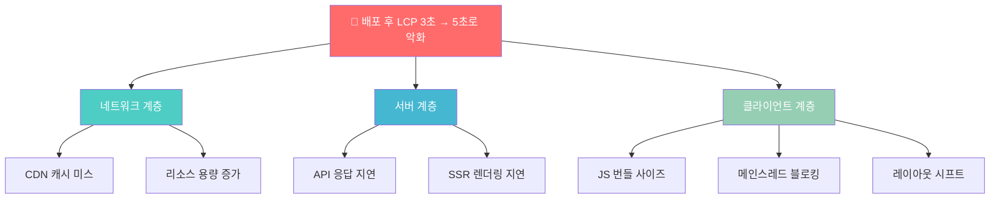
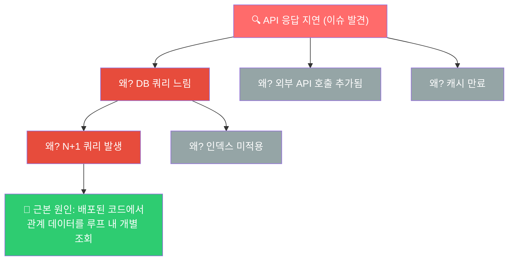
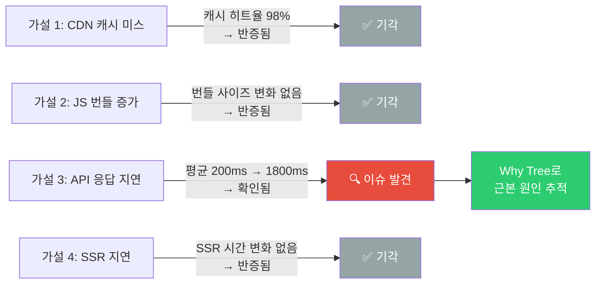
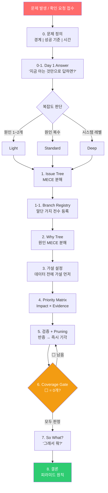

# MECE Diagnostic

**AI 코드 어시스턴트를 위한 구조화된 문제 분석 프레임워크**

McKinsey의 MECE(Mutually Exclusive, Collectively Exhaustive) 원칙과 Diagnostic Pruning 기법을 AI 코딩 어시스턴트(Claude Code)에 적용한 스킬입니다.

---

## 왜 만들었는가

### 계기 1: AI가 첫 번째 원인에만 달려드는 문제

AI 시대가 되면서 개발 과정에서 AI에게 원인 분석을 맡기는 일이 일상이 되었습니다.

- "이거 왜 안 되지?" → AI에게 물어봄 → AI가 원인 하나만 추측하고 바로 수정 시도
- 결과: **진짜 원인을 놓치고, 수정이 또 다른 문제를 만들고, 같은 질문을 반복**

문제는 AI가 **"첫 번째로 떠오른 원인"에 바로 달려든다**는 것입니다. 사람이 하는 것처럼 가능한 원인을 빠짐없이 나열하고, 하나씩 검증하며 기각하는 과정이 빠져 있습니다.

```
❌ 기존 AI 분석 흐름

  "배포 후 페이지 느려짐"
       │
       ▼
  "번들 사이즈 문제인 것 같습니다"  ← 첫 번째 추측에 바로 달려듦
       │
       ▼
  번들 최적화 시도... 실패
       │
       ▼
  "그러면 이미지 최적화를..."  ← 또 추측
       │
       ▼
  ♻️ 반복 (진짜 원인: DB 쿼리 N+1 문제)
```

### 계기 2: 외부 팀에서 쏟아지는 확인 요청에 즉시 대응

실제로 다른 팀에서 개발 측으로 확인 요청이 빈번하게 들어옵니다.

- "이 API 응답이 느린데 프론트 문제인가요?"
- "이 데이터가 이상한데 로직 버그인가요?"
- "배포 후 이 기능이 안 되는데 확인해주세요"

이런 요청이 올 때마다 하나하나 수동으로 파악하면 시간이 걸리고, 빠뜨리는 항목이 생깁니다. MECE Diagnostic을 통해 **가능한 원인을 구조적으로 전수 파악하고, 즉시 대응**할 수 있게 하고 싶었습니다.

"확인해봤는데 프론트 문제는 아닌 것 같습니다"가 아니라, **"이 5가지 가능성을 모두 확인했고, 3번이 원인입니다"**라고 근거와 함께 답할 수 있어야 합니다.

**MECE Diagnostic은 이 두 가지 문제를 해결합니다.**

> AI를 통해 확인하는 모든 사항을 — 원인 분석, 아키텍처 결정, 성능 조사, 외부 확인 요청 대응 등 — 구조화된 프레임워크로 사전 검증하여, **빠짐없이 검증된 답**을 얻기 위한 도구입니다.

---

## 맥킨지 방법론 시각 가이드

### MECE란?

**M**utually **E**xclusive, **C**ollectively **E**xhaustive — 상호배타적이고, 전체를 포괄하는 분해.

```
  ❌ MECE가 아닌 분해                    ✅ MECE인 분해

  "페이지가 느린 이유"                   "페이지가 느린 이유"

  ┌──────────┐ ┌──────────┐            ┌──────────┐ ┌──────────┐ ┌──────────┐
  │  렌더링   │ │  API     │            │ 네트워크  │ │  서버    │ │ 클라이언트│
  │  문제    │ │  느림    │            │ (전송)   │ │ (처리)   │ │ (렌더링) │
  └──────────┘ └──────────┘            └──────────┘ └──────────┘ └──────────┘
       ↑                                    ↑           ↑           ↑
  "API 느림"이 렌더링과                 겹침 없음(ME) + 빠짐 없음(CE)
  겹칠 수 있음 → 누락도 있음            = 응답시간의 수학적 분해
```

> **핵심**: MECE가 아니면 "이미 확인한 것"을 다시 확인하거나, "아무도 확인 안 한 것"이 생깁니다.

### Issue Tree — 문제를 MECE하게 분해

문제를 최상위 질문에서 시작하여 하위 이슈로 쪼갭니다.



이 트리의 **모든 말단 가지**(A1, A2, B1, B2, C1, C2, C3)를 Branch Registry에 등록합니다:

| # | 가지 | 판정 | 근거 |
|---|------|------|------|
| 1 | CDN 캐시 미스 | ⬜ | |
| 2 | 리소스 용량 증가 | ⬜ | |
| 3 | API 응답 지연 | ⬜ | |
| 4 | SSR 렌더링 지연 | ⬜ | |
| 5 | JS 번들 사이즈 | ⬜ | |
| 6 | 메인스레드 블로킹 | ⬜ | |
| 7 | 레이아웃 시프트 | ⬜ | |

> **⬜가 하나라도 남아 있으면 결론을 내릴 수 없습니다.** 이것이 Coverage Gate입니다.

### Why Tree — 원인을 깊이 파고들기

Issue Tree에서 이슈를 발견하면, **왜?**를 반복하며 근본 원인까지 내려갑니다.



### 분해 전략 4종 — 시각 비교

```
┌─────────────────────────────────────────────────────────────────────┐
│  수학적 분해: 수식으로 나눈다                                          │
│                                                                     │
│  응답시간 = 네트워크(200ms) + 서버(1800ms) + 렌더링(500ms)             │
│             ──────────        ───────────     ──────────             │
│                8%                72% ★           20%                 │
│                                                                     │
│  → 서버가 72%를 차지 → 서버부터 조사                                    │
└─────────────────────────────────────────────────────────────────────┘

┌─────────────────────────────────────────────────────────────────────┐
│  프로세스 분해: 흐름 단계별로 나눈다                                     │
│                                                                     │
│  요청 → [인증] → [라우팅] → [비즈니스 로직] → [DB 쿼리] → 응답         │
│           OK       OK        OK              ★ 느림!                 │
│                                                                     │
│  → 어느 단계에서 병목이 생기는지 특정                                    │
└─────────────────────────────────────────────────────────────────────┘

┌─────────────────────────────────────────────────────────────────────┐
│  세그먼트 분해: 범주별로 나눈다                                         │
│                                                                     │
│  ┌─────────┐  ┌─────────┐  ┌─────────┐                             │
│  │   iOS   │  │ Android │  │   Web   │                              │
│  │  정상   │  │  정상   │  │ ★ 느림  │                               │
│  └─────────┘  └─────────┘  └─────────┘                              │
│                                                                     │
│  → Web에서만 발생 → Web 전용 코드 경로 조사                             │
└─────────────────────────────────────────────────────────────────────┘

┌─────────────────────────────────────────────────────────────────────┐
│  내부-외부 분해: 통제 가능 여부로 나눈다                                 │
│                                                                     │
│  ┌─── 내부 (우리가 통제) ───┐  ┌─── 외부 (통제 불가) ───┐            │
│  │ 코드 변경               │  │ 외부 API 장애          │             │
│  │ 설정 오류               │  │ CDN 문제              │              │
│  │ DB 스키마 변경           │  │ 네트워크 인프라         │             │
│  └─────────────────────────┘  └───────────────────────┘             │
│                                                                     │
│  → 내부 문제면 즉시 수정 가능, 외부면 대응 전략 수립                      │
└─────────────────────────────────────────────────────────────────────┘
```

### Pruning — 검증하고 가지치기



> **Kill Fast**: 반증되면 미련 없이 기각합니다. 기각된 가설은 Pruning 기록에 남겨 같은 검증을 반복하지 않습니다.

### 전체 흐름 — 한눈에 보기



---

## 핵심 아이디어

| 기존 AI 분석 | MECE Diagnostic 적용 |
|---|---|
| 원인을 하나 추측하고 바로 수정 | 가능한 원인을 **전수 나열**(Issue Tree)한 뒤 검증 |
| 반증 없이 가설에 집착 | 반증되면 **즉시 기각**(Kill Fast) |
| 기각한 가설은 잊어버림 | **Pruning 기록**으로 추적 |
| "충분히 찾은 것 같다"로 마무리 | **Coverage Gate** — 모든 가지를 판정해야 결론 가능 |
| 결론이 나열식 | **피라미드 원칙** — 결론 먼저, 근거는 아래에 |

---

## Adaptive Depth — 복잡도에 따른 분석 깊이 조절

모든 문제에 동일한 깊이를 적용하지 않습니다. 복잡도를 먼저 판단하고 적절한 레벨을 선택합니다.

| 레벨 | 조건 | 프로세스 | 예시 |
|------|------|----------|------|
| **Light** | 원인 1~2개 추정 | Issue Tree 2단계 → 가설 1개 → 검증 | API 404 반환, 빌드 에러 |
| **Standard** | 원인 복수, 상호작용 가능 | Full Why Tree → 가설 2~3개 → Priority Matrix | 간헐적 테스트 실패, 배포 후 성능 저하 |
| **Deep** | 시스템 레벨, 다수 이해관계자 | 전체 플로우 + 반복 수렴 + What Tree | 아키텍처 전환 결정, 시스템 장애 RCA |

**격상은 있되, 격하는 없다.** 분석 중 복잡도가 예상보다 높으면 즉시 상위 레벨로 올립니다.

---

## 사용법

### Claude Code 스킬로 설치

이 레포의 `skill/` 디렉토리를 Claude Code 스킬로 등록합니다.

```bash
# 스킬 디렉토리에 복사
cp -r skill/* ~/.claude/skills/mece-diagnostic/
```

### 자동 트리거

다음 상황에서 자동으로 MECE Diagnostic이 작동합니다:

- 버그/에러 원인 분석
- 성능 저하 조사
- 아키텍처/설계 의사결정
- 코드베이스 탐색 및 이해
- 트레이드오프 평가

### 수동 호출

```
/mece-diagnostic
```

어떤 상황에서든 명시적으로 프레임워크를 적용할 수 있습니다.

### 스킵 조건

단순 작업에는 적용되지 않습니다:
- rename, format, 단일 파일 수정 등 단순 실행 작업
- 명확한 지시가 있는 구현 작업
- 이미 원인이 확정된 수정 작업

---

## 분해 전략 4종

Why Tree에서 원인을 분해할 때 사용하는 전략입니다:

| 전략 | 설명 | 예시 |
|------|------|------|
| **수학적 분해** | 수식으로 분해 | 응답시간 = 네트워크 + 서버 처리 + 렌더링 |
| **프로세스 분해** | 흐름 단계별 분해 | 요청 → 인증 → 라우팅 → 처리 → 응답 |
| **세그먼트 분해** | 범주별 분해 | iOS / Android / Web |
| **내부-외부 분해** | 통제 가능 여부 | 코드 변경(내부) vs 외부 API 장애(외부) |

---

## 장점

### 1. 빠짐없는 검증 (No Blind Spots)

Branch Registry + Coverage Gate 메커니즘으로 **"이 가지는 괜찮겠지"라는 생략을 원천 차단**합니다. 모든 가지를 판정(🔍 이슈 발견 / ✅ 기각 / ⏸ 보류)해야만 결론을 내릴 수 있습니다.

### 2. 가설 우선 사고 (Hypothesis-First)

데이터를 먼저 보고 원인을 찾는 귀납적 접근 대신, **가설을 먼저 세우고 반증 데이터를 찾는 연역적 접근**을 강제합니다. 이는 확증 편향을 방지합니다.

### 3. 추적 가능한 분석 (Traceable Reasoning)

Pruning 기록으로 기각된 가설과 그 이유가 모두 남습니다. "왜 이 원인은 아니라고 판단했는가?"에 답할 수 있습니다. 동료에게 분석 결과를 공유할 때 **근거를 보여줄 수 있습니다.**

### 4. 적응적 깊이 (Adaptive Depth)

간단한 버그(Light)와 시스템 장애 분석(Deep)에 같은 프로세스를 쓰지 않습니다. 복잡도를 먼저 판단하고 적절한 깊이만 적용하여 **과잉 분석을 방지**합니다.

### 5. 피라미드 원칙 출력

결론이 먼저 오고 근거가 아래에 배치됩니다. 바쁜 동료나 리더가 **첫 문단만 읽어도 핵심을 파악**할 수 있습니다.

---

## 출력 형식 예시

```
## 결론 (피라미드 꼭대기)
[핵심 발견 1~3줄 요약]

## Day 1 Answer → 최종 결론 변화
- Day 1: [초기 가설]
- 최종: [분석 후 결론]
- 차이 원인: [왜 달라졌는지]

## 문제 정의
| 경계 | 성공 기준 | 시간 프레임 | 의사결정자 |

## Issue Tree + Branch Registry
[트리 시각화 + 전수 판정 테이블]

## 가지별 분석
### 가지 A: [제목]
**판정**: 🔍 이슈 / ✅ 기각
**So What?**: [이 발견이 의사결정에 미치는 영향]

## Pruning 기록
| 가설/가지 | 판정 | 근거 |

## Coverage Gate 확인
가지 수: N개 / 판정 완료: N개 / ⬜ 잔여: 0개
```

---

## 파일 구조

```
skill/
├── SKILL.md              # 메인 스킬 정의 (프레임워크 전체)
├── complexity-guide.md    # 복잡도 판단 가이드 (Light/Standard/Deep)
└── templates.md           # Issue Tree, Why Tree, 가설 카드 등 템플릿
```

---

## 배경

이 프레임워크는 McKinsey의 문제 해결 방법론을 기반으로 합니다:

- **MECE 원칙** — Mutually Exclusive, Collectively Exhaustive (상호배타적, 전체포괄적)
- **Diagnostic Pruning** — 가설을 세우고 반증으로 가지치기
- **피라미드 원칙** — 결론 먼저, 근거는 아래로
- **Day 1 Answer** — 불완전해도 초기 가설부터 세우기

이를 소프트웨어 엔지니어링 컨텍스트에 맞게 재해석하여, AI 코드 어시스턴트가 구조화된 사고를 하도록 강제하는 스킬로 구현했습니다.

---

## License

MIT
