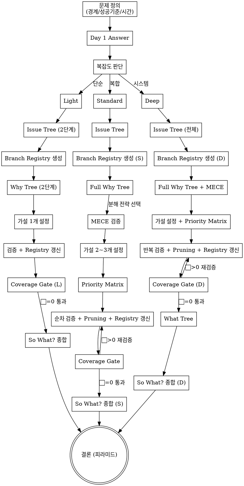

# MECE Diagnostic

McKinsey Diagnostic Pruning 기반의 구조화된 사고 프레임워크. 소프트웨어 엔지니어링, 비즈니스 분석, 전략적 의사결정에 보편적으로 적용.

**Type: RIGID** — 이 스킬의 프로세스를 정확히 따라야 한다.

## 트리거 조건

### 자동 트리거
- 버그/에러 원인 분석
- 성능 저하 조사
- 아키텍처/설계 의사결정
- 코드베이스 탐색 및 이해
- 트레이드오프 평가
- 비즈니스 문제 분석

### 스킵
- 단순 실행 작업 (rename, format, 단일 파일 수정)
- 명확한 지시가 있는 구현 작업
- 이미 원인이 확정된 수정 작업

### 수동 호출
`/mece-diagnostic` — 어떤 상황에서든 명시적으로 프레임워크 적용

## Adaptive Depth

문제 복잡도를 먼저 판단하고 적절한 깊이를 선택한다. 판단 기준은 complexity-guide.md 참조.

| 레벨 | 조건 | 프로세스 | 소요 |
|------|------|----------|------|
| **Light** | 원인이 1~2개로 추정됨 | Issue Tree → Why Tree 2단계 → 가설 1개 → 검증 | 짧음 |
| **Standard** | 원인 복수, 상호작용 가능 | Full Why Tree → 가설 2~3개 → Priority Matrix → Pruning | 중간 |
| **Deep** | 시스템 레벨, 다수 이해관계자 | 전체 플로우 + 반복 수렴 + What Tree | 길음 |

**격상 규칙**: 분석 중 복잡도가 예상보다 높으면 즉시 상위 레벨로 격상. 격하는 없음.

## 프레임워크

### 0. 문제 정의 (Problem Definition)

**"잘 정의된 문제는 반쯤 해결된 문제."** Issue Tree를 만들기 전에 반드시 문제를 정의한다.

| 항목 | 정의할 내용 | 예시 |
|------|-----------|------|
| **경계** | 무엇이 포함되고 무엇이 제외되는가 | "프론트엔드 코드만. 백엔드/인프라 제외" |
| **성공 기준** | 무엇을 달성하면 해결된 것인가 | "LCP 2.5초 이하, CLS 0.1 이하" |
| **시간 프레임** | 언제까지 답이 필요한가 | "이번 스프린트 내 분석 완료" |
| **의사결정자** | 최종 판단은 누가 하는가 | "사용자가 우선순위 검토 후 결정" |

경계가 모호하면 Issue Tree가 무한 확장되거나 엉뚱한 가지를 파게 된다. **경계 먼저, 분해는 그 다음.**

### 0-1. Day 1 Answer — 초기 가설

문제를 정의한 직후, 분석 전에 **"지금 알고 있는 것만으로 답을 내린다면?"**을 먼저 적는다. 이것이 Day 1 Answer.

- 직관과 경험에 의존해도 좋다. 정확할 필요 없다.
- 분석 과정에서 Day 1 Answer를 계속 업데이트한다.
- 최종 결론이 Day 1 Answer와 다르면 **왜 달라졌는지**를 기록한다.

Day 1 Answer의 목적: 분석의 방향을 잡고, 막다른 길을 빨리 발견하고, "데이터가 말해줄 것이다"는 수동적 태도를 방지.

### 1. Issue Tree — 문제를 구조화

문제를 MECE하게 하위 이슈로 분해. 최상위 질문에서 시작하여 2~3단계로 분해.

**검증된 프레임워크 활용**: 매번 처음부터 MECE 구조를 만들지 않는다. 도메인에 이미 MECE로 설계된 프레임워크가 있으면 출발점으로 쓴다.

| 문제 도메인 | 출발점 프레임워크 |
|------------|-----------------|
| 수익성 분석 | 매출(가격×수량) vs 비용(고정+변동) |
| 시장 분석 | 3C (Company, Customer, Competitor) |
| 산업 분석 | Porter's Five Forces |
| 웹 성능 | Core Web Vitals (LCP, INP, CLS) |
| SEO | Technical / On-Page / Performance |
| 보안 | OWASP Top 10 |
| 시스템 장애 | 인프라 / 애플리케이션 / 외부 의존성 |

프레임워크는 **출발점**이지 **정답**이 아니다. 프로젝트에 맞게 가지를 추가/제거/재구성한다.

```
문제: [최상위 질문]
├── 이슈 A
│   ├── 하위 이슈 A-1
│   └── 하위 이슈 A-2
└── 이슈 B
    ├── 하위 이슈 B-1
    └── 하위 이슈 B-2
```

### 1-1. Branch Registry — 가지 전수 추적

**Issue Tree 작성 직후, 모든 말단 가지(leaf node)를 번호 매겨 등록한다.** 이것이 분석 완료까지 추적하는 체크리스트가 된다.

```
## Branch Registry (N개 가지)
| # | 가지 | 판정 | 근거 |
|---|------|------|------|
| 1 | A-1 | ⬜ | |
| 2 | A-2 | ⬜ | |
| 3 | B-1 | ⬜ | |
| 4 | B-2 | ⬜ | |
```

**판정 상태** (⬜ 빈 칸은 허용하지 않는다):
- 🔍 **이슈 발견** — 문제 확인됨. 상세 분석 진행.
- ✅ **기각** — 검증 결과 이슈 없음. 반드시 근거(코드 경로, 데이터, 확인 방법) 기재.
- ⏸ **보류** — 검증 불가(데이터 미접근 등). 사유 기재. 보류는 최소화.

**Registry 규칙**:
1. Issue Tree를 수정하면 Registry도 즉시 동기화한다.
2. 분석 도중 가지가 추가/분할되면 Registry에 행을 추가한다.
3. **⬜ 상태의 가지가 하나라도 남아 있으면 분석을 종료할 수 없다.**

### 2. Why Tree — 원인을 MECE 분해

각 이슈의 원인을 탐색. 분해 전략 4종 중 적절한 것을 선택:

| 전략 | 설명 | 예시 |
|------|------|------|
| **수학적 분해** | 수식으로 분해 | 응답시간 = 네트워크 + 서버 처리 + 렌더링 |
| **프로세스 분해** | 흐름 단계별 분해 | 요청 → 인증 → 라우팅 → 처리 → 응답 |
| **세그먼트 분해** | 범주별 분해 | iOS / Android / Web, 신규 / 기존 사용자 |
| **내부-외부 분해** | 통제 가능 여부 | 코드 변경(내부) vs 외부 API 장애(외부) |

**MECE 검증**: 각 분해 후 반드시 확인 — 상호배타적인가? 전체를 포괄하는가?

### 3. Hypothesis-Driven Thinking — 가설 우선

데이터 수집 전에 가설을 먼저 세운다.

- **가설 구조**: "[원인 X] 때문에 [문제 Y]가 발생한다. 왜냐하면 [근거 Z]."
- **검증 방법**: 가설을 반증할 수 있는 최소 데이터를 정의
- **빠른 기각**: 반증되면 즉시 폐기하고 다음 가설로 이동

### 3-1. 검증 전략 — 가설을 어떻게 반증하는가

가설을 세운 후, **어떤 데이터를 어떤 도구로 확인하는지** 구체적으로 매핑한다.

#### SW 컨텍스트 검증 테이블

| 가설 유형 | 필요 데이터 | 검증 도구/방법 | 반증 신호 |
|-----------|------------|---------------|-----------|
| 코드 버그 | 소스코드, 변경 이력 | `Grep`, `Read`, `git blame`, `git log` | 해당 로직에 문제 없음 → 기각 |
| 성능 문제 | 프로파일링, 응답 시간 | 테스트 실행(`Bash`), 로그 분석(`Grep`) | 메트릭이 정상 범위 → 기각 |
| 설정/환경 | env, config 파일 | `Read`로 설정 비교, 환경 diff | 설정이 일치 → 기각 |
| 의존성 | package.json, lock file, changelog | `Read`, `npm ls`, 버전 비교 | 버전 변경 없음 → 기각 |
| 라우팅/API | 라우트 정의, 미들웨어 | `Grep`으로 라우트 검색, API 호출 테스트 | 라우트 정상 등록 → 기각 |
| 상태 관리 | store 정의, 사용처 | `Grep`으로 사용처 추적, 데이터 흐름 추적 | 상태가 정상 업데이트 → 기각 |

#### 비즈니스 컨텍스트 검증 테이블

| 가설 유형 | 필요 데이터 | 검증 도구/방법 | 반증 신호 |
|-----------|------------|---------------|-----------|
| 시장/경쟁 | 시장 데이터, 경쟁사 정보 | `WebSearch`, 산업 리포트 | 시장 트렌드가 가설과 불일치 → 기각 |
| 사용자 행동 | 사용 패턴, 이탈률 | Analytics MCP, DB 쿼리 | 데이터가 가설 패턴과 불일치 → 기각 |
| 재무/비용 | 매출, 비용 구조 | 내부 대시보드, 스프레드시트 | 수치가 가설 추정과 불일치 → 기각 |
| 운영 프로세스 | 워크플로우, 병목 | 이슈 트래커(Linear/Jira MCP), 로그 | 프로세스가 정상 작동 → 기각 |

#### 외부 데이터 접근 가이드

```
외부 데이터가 필요한 경우:
1. 사용 가능한 MCP 서버 확인 (모니터링, DB, 이슈 트래커 등)
2. MCP가 없으면 → WebSearch/WebFetch로 공개 데이터 확인
3. 둘 다 불가 → 사용자에게 데이터 제공 요청 (구체적으로 어떤 데이터가 필요한지 명시)

원칙: 데이터 접근이 불가능한 가설은 "검증 불가(⏸ 보류)"로 Pruning 기록하고 다음 가설로 이동
```

### 4. Priority Matrix — 가설 우선순위

가설이 복수일 때 검증 순서를 결정:

| 가설 | Impact (영향 범위) | Evidence (검증 용이성) | 우선순위 |
|------|-------------------|----------------------|----------|
| 가설 1 | High / Medium / Low | High / Medium / Low | 계산 |

**Impact × Evidence** 순으로 검증. 둘 다 높은 것부터.

### 5. So What? — 종합

**분석에서 가장 어려운 단계.** 데이터를 나열하는 것이 아니라, 의사결정에 어떤 의미를 갖는지를 뽑아낸다.

모든 발견에 대해 **"그래서 뭐?"**를 묻는다:

```
발견: "홈페이지 히어로 배너가 SSR에 포함되지 않는다"
→ So What? "LCP 요소가 클라이언트 렌더링 후에야 표시된다"
→ So What? "Google CWV에서 LCP 점수가 직접 악화된다"
→ So What? "검색 순위 하락 위험. 긴급 대응 필요."
```

So What은 마지막이 아니라 **분석 내내** 이루어져야 한다. 가지를 검증할 때마다 Day 1 Answer를 업데이트하라.

**중요한 것 vs 흥미로운 것**: 모든 발견이 보고서에 들어갈 필요는 없다. 의사결정에 영향을 미치는 발견만 남기고, 나머지는 Pruning 기록에 둔다.

### 6. What Tree — 해결 방안 구조화 (Deep 전용)

원인 확정 후, 해결 방안을 MECE하게 분해:

```
해결 방안
├── 단기 (즉시 적용)
│   ├── 방안 1
│   └── 방안 2
└── 장기 (구조적 개선)
    ├── 방안 3
    └── 방안 4
```

## 프로세스 흐름



## 출력 형식

**피라미드 원칙**: 결론을 먼저 말하고, 근거를 아래에 배치한다. 독자가 첫 문단만 읽어도 핵심을 파악할 수 있어야 한다.

```
## 결론 (피라미드 꼭대기)
[핵심 발견 1~3줄 요약. "So What?"에 대한 답]

## Day 1 Answer → 최종 결론 변화
- Day 1: [초기 가설]
- 최종: [분석 후 결론]
- 차이 원인: [왜 달라졌는지]

## 문제 정의
| 경계 | 성공 기준 | 시간 프레임 | 의사결정자 |

## Issue Tree + Branch Registry
[트리 시각화 + 전수 판정 테이블]

## 가지별 분석 (피라미드 근거 레이어)
### 가지 A: [제목]
**판정**: 🔍 이슈 / ✅ 기각
**So What?**: [이 발견이 의사결정에 미치는 영향]
[상세 분석...]

### 가지 B: [제목]
...

## Pruning 기록
| 가설/가지 | 판정 | 근거 |

## Coverage Gate 확인
가지 수: N개 / 판정 완료: N개 / ⬜ 잔여: 0개
```

**반복적 접근**: 위 형식은 최종 출력이다. 분석 과정에서는 톱다운(Issue Tree → 가설)과 바텀업(검증 결과 → 트리 수정) 사이를 여러 번 오간다. 처음 세운 트리가 최종 트리일 필요 없다. 검증 과정에서 가지가 추가/분할/병합되면 Registry를 즉시 동기화한다.

## 핵심 원칙

1. **MECE 무결성**: 모든 분해는 상호배타적이고 전체를 포괄해야 한다. 겹침이나 누락이 있으면 분해를 다시 한다.
2. **가설 우선**: 데이터를 모으기 전에 가설을 먼저 세운다. "데이터가 말해줄 것이다"는 금지.
3. **빠른 기각 (Kill Fast)**: 반증되면 즉시 폐기. 가설에 집착하지 않는다.
4. **전수 검증, 차등 깊이 (80/20 재정의)**: **모든 가지를 반드시 검증한다. 건너뛰는 가지는 없다.** Impact가 큰 20%의 가지는 더 깊이 파고, 나머지는 빠르게 검증/기각한다. "범위"를 좁히는 것이 아니라 "깊이"를 조절하는 것이다.
5. **Pruning 기록**: 기각된 가설과 이유를 반드시 기록한다. 나중에 재검토할 수 있어야 한다.
6. **MECE 보존**: Pruning 후에도 남은 가지들이 MECE를 유지하는지 확인한다.
7. **Coverage Gate**: 결론을 내리기 전에 Branch Registry의 모든 가지가 판정 완료(🔍/✅/⏸)되었는지 확인한다. ⬜가 남아 있으면 결론 금지.

## SW 컨텍스트 매핑

| 매뉴얼 개념 | 소프트웨어 엔지니어링 적용 |
|---|---|
| 매출 감소 분석 | 버그 원인, 성능 저하, 아키텍처 결정 |
| CEO 인터뷰 | 에러 로그, git blame, 코드 리뷰 |
| 코호트 데이터 | 테스트 결과, 프로파일링, 로그 분석 |
| 경영진 보고 | PR 설명, 커밋 메시지, 설계 문서 |
| Impact (매출 기여도) | Impact (영향 범위: 파일 수, 사용처, 사용자 수) |
| Evidence (시장 데이터) | Evidence (로그, 테스트, 코드 추적, 재현 가능성) |
| 경쟁사 벤치마크 | 유사 프로젝트, 라이브러리 문서, 공식 가이드 |

## Quality Checklist

**결론을 내리기 전에 반드시 확인. 하나라도 미충족 시 결론 금지:**

- [ ] **문제 정의**: 경계, 성공 기준, 시간 프레임이 명확한가?
- [ ] **Day 1 Answer**: 초기 가설을 기록했는가? 최종 결론과의 차이를 설명했는가?
- [ ] **Coverage Gate**: Branch Registry에 ⬜(미판정) 가지가 0개인가? (`가지 수 == 판정 수` 확인)
- [ ] 모든 분해가 MECE한가? (겹침/누락 없음)
- [ ] 가설을 데이터 전에 세웠는가?
- [ ] 기각된 가설의 Pruning 기록이 있는가? (✅ 기각에 근거가 기재되어 있는가?)
- [ ] 남은 가지들이 MECE를 유지하는가?
- [ ] **So What?**: 모든 주요 발견에 "그래서 뭐?"를 물었는가? 단순 나열이 아닌 의사결정 함의가 있는가?
- [ ] **피라미드 원칙**: 결론이 먼저 오고, 근거가 아래에 배치되어 있는가?
- [ ] 근본 원인에서 해결 방안으로의 논리적 연결이 있는가?
- [ ] 복잡도 레벨이 적절했는가? (격상이 필요했는데 안 했는가?)

## Red Flags — 합리화 경고

| 생각 | 현실 |
|------|------|
| "원인이 명확하니 분해 안 해도 된다" | 명확해 보여도 MECE 분해하면 놓친 가지가 보인다 |
| "데이터를 먼저 보고 가설을 세우자" | 확증 편향의 시작. 가설이 먼저다 |
| "이 가설이 맞을 것 같으니 더 파보자" | 반증 데이터가 있으면 즉시 기각. Kill Fast |
| "시간이 없으니 Light로 하자" | 복잡도 판단 기준을 따르라. 격상은 있되 격하는 없다 |
| "Pruning 기록은 귀찮다" | 기록 없으면 같은 가설을 반복 검증하게 된다 |
| "한 가지만 깊이 파면 된다" | 80/20은 깊이 조절이지 범위 축소가 아니다. 모든 가지를 검증하라 |
| "이 가지는 괜찮겠지" | **가장 위험한 생각.** "괜찮겠지"는 검증이 아니다. 코드/데이터를 확인하고 ✅ 기각하라 |
| "이미 충분히 찾았으니 나머지는 넘어가자" | Branch Registry에 ⬜가 남아 있으면 충분하지 않다 |
| "비슷한 가지니까 하나만 확인하면 되겠지" | MECE에서 "비슷한" 가지는 없다. 상호배타적이므로 각각 검증 |

## 템플릿

상세 템플릿은 templates.md 참조.
복잡도 판단 가이드는 complexity-guide.md 참조.
