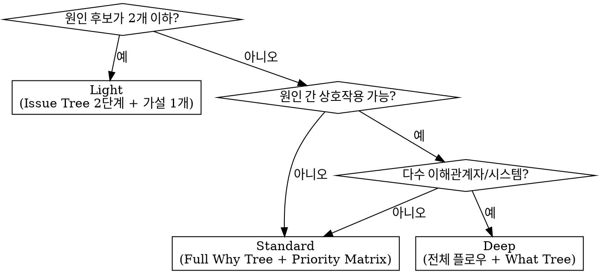

# Complexity Guide — 복잡도 판단 가이드

## 판단 플로우

## Light

**조건:**
- 원인 후보가 1~2개로 명확히 추정됨
- 단일 컴포넌트/모듈 내 문제
- 재현이 쉽거나 에러 메시지가 구체적

**프로세스:**
1. Issue Tree 2단계 분해
2. Why Tree 2단계 (깊이 제한)
3. MECE 검증
4. 가설 1개 설정
5. 즉시 검증

**예시:**
- "이 API가 404를 반환한다" → URL 오타 or 라우트 미등록
- "이 버튼 클릭 시 아무 반응이 없다" → 이벤트 핸들러 누락 or 조건부 렌더링 문제
- "빌드 에러: Module not found" → import 경로 오류 or 패키지 미설치

**소요:** 분석 1~2분

## Standard

**조건:**
- 원인 후보가 3개 이상
- 여러 모듈/레이어에 걸친 문제
- 재현 조건이 복잡하거나 간헐적 발생

**프로세스:**
1. Issue Tree 전체 구성
2. Full Why Tree (분해 전략 선택)
3. MECE 검증
4. 가설 2~3개 설정
5. Priority Matrix로 검증 순서 결정
6. 순차 검증 + Pruning 기록
7. 근본 원인 확정

**예시:**
- "특정 사용자만 로그인 실패" → 인증/세션/DB/네트워크 등 다수 원인
- "배포 후 성능 20% 저하" → 코드 변경/DB 쿼리/캐시/인프라 등
- "간헐적 테스트 실패" → 타이밍/상태 오염/외부 의존성/순서 의존

**소요:** 분석 5~15분

## Deep

**조건:**
- 시스템 레벨 문제 (여러 서비스/팀에 걸침)
- 아키텍처 의사결정이 필요
- 다수 이해관계자 또는 장기적 영향
- 비즈니스 전략 분석

**프로세스:**
1. Issue Tree 전체 구성 (3단계 이상)
2. Full Why Tree + MECE 검증 (분해 전략 복합 사용)
3. 가설 설정 + Priority Matrix
4. 반복 검증 + Pruning (수렴할 때까지)
5. 근본 원인 확정
6. What Tree — 해결 방안 MECE 분해 (단기/장기)
7. 최종 권고

**예시:**
- "마이크로서비스 전환 vs 모놀리스 유지" → 기술/조직/비용/일정 등 다차원
- "전체 시스템 장애 RCA(Root Cause Analysis)" → 인프라/코드/프로세스/모니터링
- "신규 시장 진출 전략" → 시장/경쟁/역량/리스크 등

**소요:** 분석 30분+

## 격상 규칙

분석 도중 다음 신호가 나타나면 즉시 상위 레벨로 격상:

| 신호 | 격상 |
|------|------|
| Light에서 가설이 반증되고 새 원인 후보가 2개 이상 나옴 | → Standard |
| Standard에서 Pruning 후에도 원인 후보가 수렴하지 않음 | → Deep |
| Standard에서 해결 방안이 여러 시스템에 걸침 | → Deep |
| 어느 레벨에서든 "이건 생각보다 복잡하다"는 판단 | → 한 단계 격상 |

**격하는 없다.** 한번 올린 레벨은 내리지 않는다. "생각보다 단순하네"라는 판단은 확증 편향일 수 있다.
